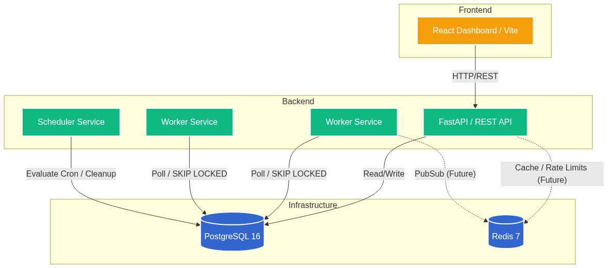
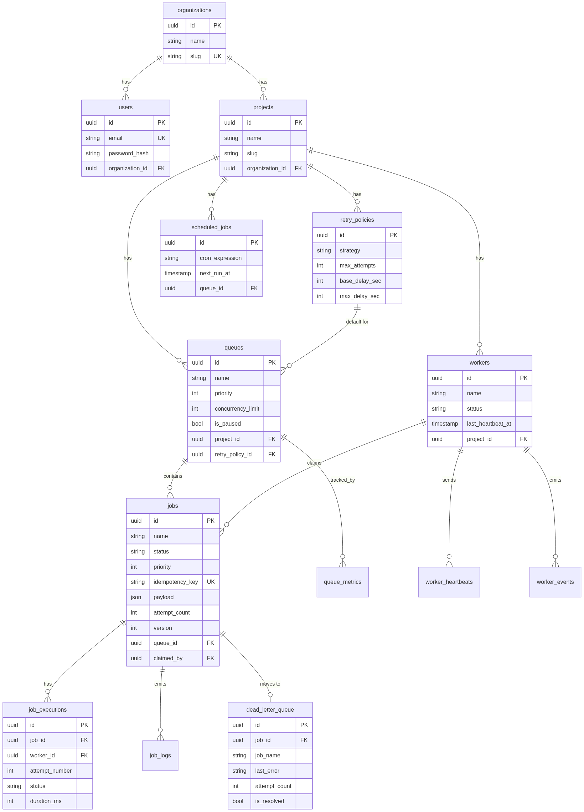
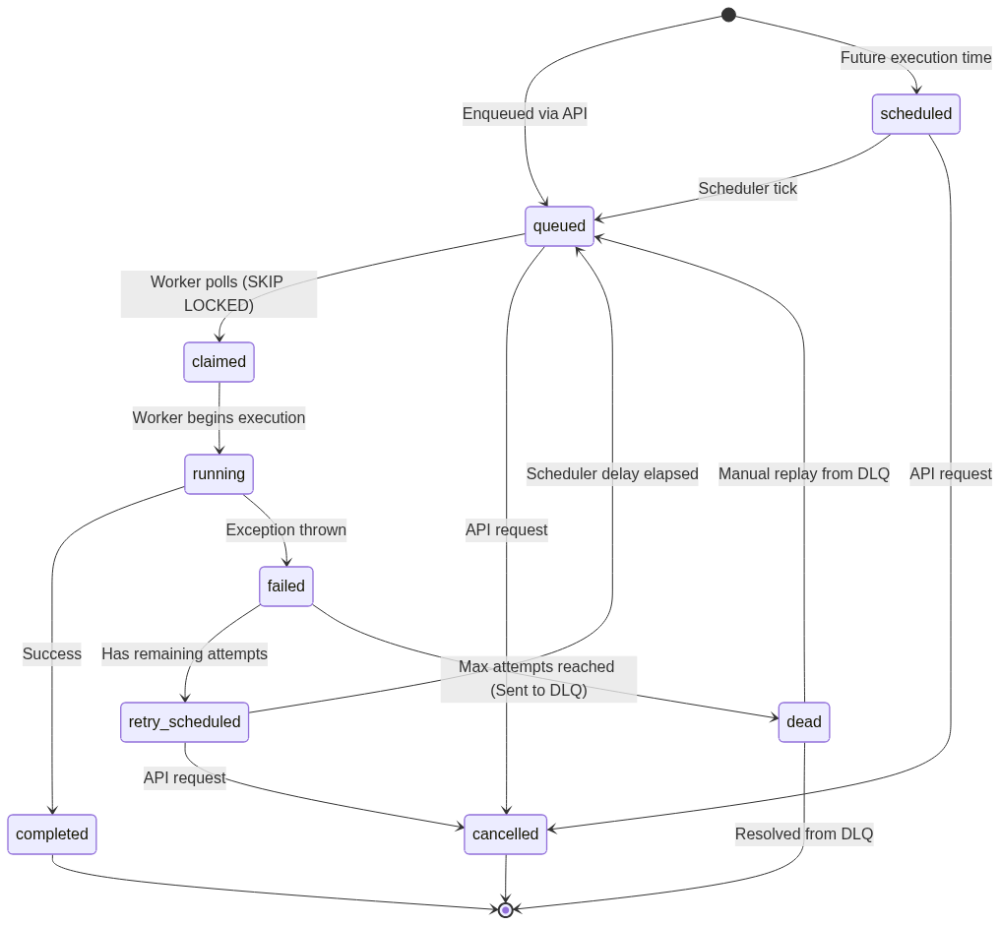

# Cronwave

A distributed job scheduler built with FastAPI, PostgreSQL, and Redis. Supports queue-based job distribution, configurable retry policies, dead letter handling, worker heartbeating, and cron-based scheduling.

## Architecture

```
cronwave/
├── apps/
│   ├── api/          # FastAPI REST API (uvicorn)
│   ├── worker/       # Job processing workers
│   ├── scheduler/    # Cron evaluation + retry requeuing
│   └── web/          # React dashboard (Vite)
├── packages/
│   ├── db/           # SQLAlchemy models, migrations, repositories
│   ├── shared/       # Types, errors, response envelope
│   ├── config/       # Pydantic Settings
│   └── logging/      # structlog configuration
├── tests/
│   ├── unit/
│   └── integration/
├── migrations/       # Alembic migrations
├── docs/             # ADRs, diagrams
├── docker-compose.yml
├── Dockerfile        # Multi-stage (api, worker, scheduler)
└── pyproject.toml
```

## Diagrams & Documentation

We have prepared comprehensive documentation and exported diagrams to explain the system's core design. These are located in the `docs/diagrams` folder.

### System Architecture
High-level overview of the API, Worker, Scheduler, and Frontend components.


### Entity Relationship (ER) Schema
Database schema covering tenant, queues, jobs, and observability.


### Job State Machine
The lifecycle of a job (queued, scheduled, running, completed, failed, dlq).


- **[Architecture Decision Records (ADRs)](docs/adr/)**: Log of major design trade-offs and choices.

## Quick Start

### Prerequisites

- Python 3.11+
- PostgreSQL 16
- Redis 7
- Node.js 18+ (for dashboard)

### Local Development

```bash
# Start dependencies
docker compose up -d postgres redis

# Create .env from template
cp .env.example .env

# Install Python dependencies
pip install -e ".[dev]"

# Run migrations
alembic upgrade head

# Start the API
uvicorn apps.api.main:app --reload --port 8000

# Start a worker (in another terminal)
python -m apps.worker.run

# Start the scheduler (in another terminal)
python -m apps.scheduler.run

# Start the dashboard (in another terminal)
cd apps/web && npm install && npm run dev
```

### Docker

```bash
docker compose up --build
```

## Key Design Decisions

### Job Claiming: `SELECT FOR UPDATE SKIP LOCKED`

Workers claim jobs using Postgres row-level locking with `SKIP LOCKED`. This avoids lock contention in multi-worker deployments — workers skip already-claimed rows instead of blocking. This is the standard pattern used at Stripe, Uber, and similar companies for queue-based systems backed by relational databases.

**Why not Redis-based queuing?** Postgres gives us transactional guarantees, ACID compliance, and joins across job/queue/worker data. Redis would require a separate data store and synchronization logic. For most workloads, Postgres handles the throughput just fine.

### Retry Strategy: Function Dispatch

Retry delays use a simple function dispatch (`{strategy: calculator_fn}`) instead of a class hierarchy. Three stateless functions that take the same arguments don't need inheritance.

### Optimistic Locking

Jobs have a `version` column incremented on every state change. This prevents race conditions when multiple processes try to update the same job — the second write will see a stale version and can detect the conflict.

### Dead Letter Queue

Jobs that exhaust all retries are copied to a separate DLQ table with denormalized fields (job name, payload, error). This keeps the DLQ operationally independent — you can browse it even if the original jobs are archived.

### Metric Snapshots

Dashboard charts read from pre-computed `queue_metrics` snapshots instead of aggregating the jobs table on every request. The scheduler writes one snapshot per queue per tick. This trades storage for read performance.

## Database Schema

14 tables organized by domain:

- **Tenant**: organizations, users, projects
- **Queues**: queues, retry_policies
- **Jobs**: jobs, job_executions, scheduled_jobs, dead_letter_queue
- **Workers**: workers, worker_heartbeats, worker_events
- **Observability**: job_logs, queue_metrics

Key indexes:
- `ix_jobs_claimable` — partial index on `status = 'queued'` for the claim query
- `ix_jobs_retry_pending` — partial index on `status = 'retry_scheduled'`
- `ix_jobs_claim` — composite index for claim ordering

## API

All endpoints return a consistent envelope:

```json
{
  "success": true,
  "data": {},
  "pagination": { "page": 1, "per_page": 50, "total": 100, "total_pages": 2 },
  "error": null,
  "error_code": null
}
```

Base URL: `/api/v1/`

| Endpoint | Method | Description |
|----------|--------|-------------|
| `/auth/register` | POST | Create account |
| `/auth/login` | POST | Get tokens |
| `/auth/me` | GET | Current user |
| `/jobs` | POST | Enqueue job |
| `/jobs` | GET | List jobs (paginated, filtered) |
| `/jobs/{id}` | GET | Job detail with executions |
| `/jobs/{id}/retry` | POST | Manual retry |
| `/jobs/{id}/cancel` | POST | Cancel job |
| `/queues` | GET/POST | List/create queues |
| `/queues/{id}/pause` | POST | Pause queue |
| `/queues/{id}/resume` | POST | Resume queue |
| `/workers` | GET | List workers |
| `/metrics/overview` | GET | Dashboard stats |
| `/dlq` | GET | List dead letter entries |
| `/dlq/{id}/replay` | POST | Re-enqueue from DLQ |
| `/dlq/{id}/resolve` | POST | Acknowledge DLQ entry |
| `/scheduled-jobs` | GET/POST | Recurring jobs |

## Testing

```bash
pytest tests/ -v
```

Focus areas:
- Retry delay calculation (all three strategies)
- Job state machine transitions
- API response envelope contract
- Domain error HTTP mapping

## Scaling Considerations

1. **More workers**: Workers are stateless — deploy N replicas. SKIP LOCKED ensures no duplicate claiming.
2. **Queue partitioning**: Workers can be configured with `queue_filter` to only process specific queues.
3. **Scheduler HA**: Single scheduler with advisory lock. For HA, implement Redis-based leader election.
4. **Metric retention**: Queue metrics table grows unbounded. Add a TTL job to prune entries older than 30 days.
5. **Job archival**: Terminal jobs can be moved to a `jobs_archive` table after N days.

## License

Internal use.
